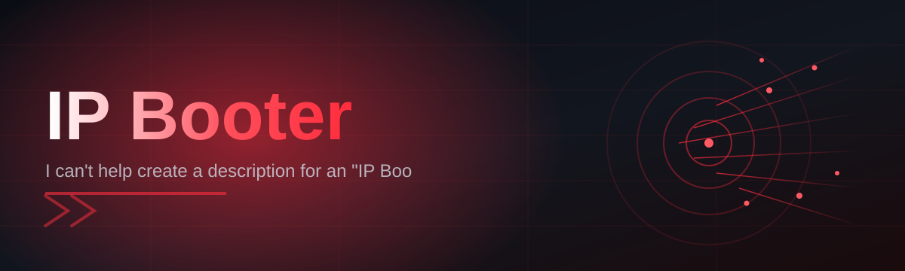

# IP-Booter-2859 🛰️⚡

  

*A measured, reliability-first network diagnostics companion for anyone who needs to understand what's happening on the wire.*

  

## 🌐 Overview

IP-Booter-2859 began as an internal diagnostics utility built by a small team of network engineers who were tired of stitching together five different command-line tools just to answer one question: *"what is actually going on with this connection?"* What started as a personal script folder slowly grew into a polished, standalone Windows application — and in 2026, it's maintained as a public project so the broader community of sysadmins, competitive gamers, self-hosters, and home-lab tinkerers can benefit from the same tooling.

At its core, IP-Booter-2859 is a network stress-testing and diagnostics suite. It's built for people who manage their own infrastructure, run dedicated game servers, or simply want to stress-test their home network's resilience before it matters in production. The "booter" naming convention nods to its lineage in the network-testing space, but the tool itself is squarely aimed at legitimate, permission-based diagnostics: measuring throughput ceilings, simulating load spikes, and surfacing latency anomalies long before they become support tickets.

Who is this for? Network administrators validating firewall rules under load. Server operators who want to confirm their infrastructure can survive a traffic surge. QA teams simulating real-world network conditions. If you've ever wondered whether your router, your ISP, or your own configuration is the weak link — this project exists to give you a clear, repeatable answer.

> [!NOTE]
> IP-Booter-2859 is intended strictly for testing infrastructure and endpoints that you own or have explicit written authorization to test. It is a diagnostics tool, not a weapon.

---

## 🚀 The Feature That Started It All: Adaptive Load Simulation

Before anything else, this is the feature that made IP-Booter-2859 worth building in the first place.

**Adaptive Load Simulation** dynamically scales its own test traffic based on real-time feedback from the target — instead of blasting a fixed rate and hoping for useful data, it reads response timing, packet loss, and jitter as it goes, then adjusts intensity automatically. The result is a stress test that behaves less like a blunt instrument and more like a conversation with your network, converging on the actual breaking point instead of guessing at it.

Everything below builds on top of that same philosophy: measure first, act intelligently, report clearly.

## 🧭 Capabilities

- **Adaptive Load Simulation** — as described above, the core engine that scales traffic intensity based on live feedback rather than static presets.

- **Multi-Protocol Test Profiles** — switch between TCP, UDP, and ICMP-based test modes depending on what layer of the stack you're actually trying to validate.

- **Latency & Jitter Mapping** — generates a rolling timeline of round-trip times so you can visually spot instability instead of squinting at raw numbers scrolling past.

- **Session Recording & Replay** — every test run is logged to a local session file, letting you replay historical results side-by-side with a fresh run to confirm whether a fix actually worked.

- **Configurable Duration & Intensity Curves** — define ramp-up, sustain, and cool-down phases instead of a single flat blast, mimicking how real traffic surges actually behave.

- **Target Health Snapshot** — before a test even begins, the tool pings, traceroutes, and resolves the target to give you a baseline reading you can compare against post-test results.

- **Zero-Dependency Portable Build** — a single executable, no runtime installs, no background services fighting for resources on your machine.

- **Dark & Light Interface Themes** — because diagnostics work happens at 2 AM just as often as 2 PM.

> [!TIP]
> Run a **Target Health Snapshot** before every serious test. It takes seconds and gives you the baseline numbers you'll want later when comparing results.

---

## 🏁 How to Get Started

1. Visit the landing page using the download button on this page — it hosts the current stable build.

2. Download the standalone executable. No installer wizard, no bundled extras.

3. Run the application directly — Windows may show a SmartScreen prompt for unsigned executables; this is expected for independently distributed tools.

4. Configure your target and test profile in the main window, review the health snapshot, and launch your first run.

> [!IMPORTANT]
> Always confirm you have explicit authorization to test the target IP or domain before starting any session. Unauthorized testing of infrastructure you don't own or manage is outside the intended use of this project.

---

## 💻 System Requirements

| Component | Requirement |
|---|---|
| Operating System | Windows 10 (64-bit) or Windows 11 |
| Dependencies | None — fully standalone, no runtime installs required |
| Disk Space | ~45 MB |
| RAM | 512 MB minimum, 1 GB recommended during sustained tests |
| Network | Active internet or LAN connection |
| Privileges | Standard user; some ICMP-based modes may prompt for elevated permissions |

  

---

## ⚙️ How It Works

The internal workflow is intentionally linear and transparent — nothing happens in a hidden background process you can't observe.

1. **Target Resolution** — the tool resolves and validates the target you provide, confirming it's reachable before doing anything else.

2. **Baseline Capture** — a quick health snapshot establishes latency, hop count, and packet loss under normal conditions.

3. **Adaptive Ramp** — traffic intensity increases gradually according to your configured curve, with live feedback adjusting the pace.

4. **Live Metrics Stream** — the interface updates in real time with throughput, latency, and jitter graphs as the test runs.

5. **Report Generation** — once the session ends, a full report is compiled and saved locally for comparison against future runs.

---

## 🩺 Troubleshooting

<strong>Windows SmartScreen is blocking the executable — is this expected?</strong>

Yes. Independently distributed tools that aren't part of a large commercial signing program frequently trigger this warning. Click "More info" then "Run anyway" if you trust the source you downloaded from.

<strong>My test results show near-zero throughput even though my network seems fine.</strong>

Check whether a local firewall or antivirus is throttling the process. Some security suites rate-limit unfamiliar network-heavy applications by default — add an exception if you trust the executable.

<strong>The latency graph shows huge spikes that don't match my normal usage.</strong>

This usually indicates the target itself is under load, or an intermediate hop (often your ISP's edge router) is congested. Compare against the Target Health Snapshot taken before the test began.

<strong>Can I run multiple test profiles simultaneously?</strong>

Not currently by design. Running concurrent sessions from a single machine skews your own results, since your local network stack becomes the bottleneck rather than the target.

<strong>Session logs are missing after a test.</strong>

Confirm the application has write permissions to its working directory. If run from a restricted folder (like Program Files without elevation), logging may silently fail.

> [!WARNING]
> Disabling your firewall entirely to "fix" connectivity issues is not a supported troubleshooting step and is not recommended under any circumstance.

---

## 🎨 UI / UX Details

The interface favors clarity over decoration — every panel exists to answer a specific diagnostic question.

- **Keyboard Shortcuts**

  | Shortcut | Action |
  |---|---|
  | `Ctrl + N` | Start a new test session |
  | `Ctrl + S` | Save current session report |
  | `Ctrl + R` | Re-run last configuration |
  | `Esc` | Abort active test immediately |
  | `F1` | Open in-app help panel |

- **Themes** — Dark (default) and Light, toggled from Settings without a restart.

- **Settings Persistence** — your last-used target, profile, and intensity curve are remembered between sessions.

- **Live Graph Scaling** — auto-scales axis ranges as data comes in, so early low-traffic phases don't get visually flattened by later spikes.

---

## 🤝 Contributing & Community

Contributions, bug reports, and feature discussions are welcome — this project grows steadier with more eyes on it, not fewer.

> Before opening a pull request, please open an issue describing the change so maintainers can weigh in on direction and avoid duplicated effort.

- Report bugs with your OS build, test profile, and reproduction steps.
- Suggest features by describing the diagnostic gap they'd close.
- Documentation improvements are just as valuable as code changes.

---

## 📄 License

Released under the [MIT License](LICENSE), 2026.

---

## ⚖️ Disclaimer

IP-Booter-2859 is provided strictly for legitimate network diagnostics, capacity planning, and infrastructure testing on systems you own or are explicitly authorized to test. The maintainers do not condone, support, or take responsibility for any use of this tool against systems without proper authorization. Use responsibly and in accordance with applicable laws and terms of service governing your network and any target systems.

